The generated .ply 3D mesh files would be saved here!
You can use .ply visualization tool such as MeshLab to visualize it
This folder includes some visualization results given the pre-processed images (in ./tmp folder)

***Note that the generated .ply files are not put here now but only the visualization results (.png files)***

### input: ### 

### 3D Face Model: ### 
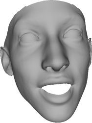

### input: ### 

### 3D Face Model: ### 
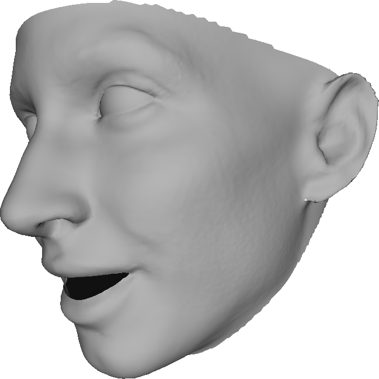

### input: ### 

### 3D Face Model: ### 
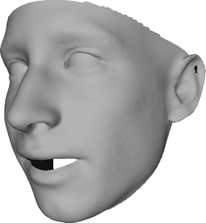

### input: ### 

### 3D Face Model: ### 
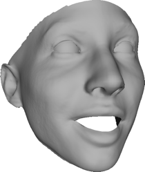

### input: ### 

### 3D Face Model: ### 

### input: ### 

### 3D Face Model: ### 
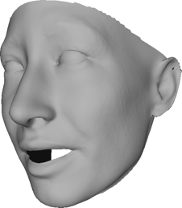

### input: ### 
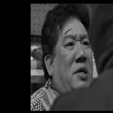
### 3D Face Model: ### 
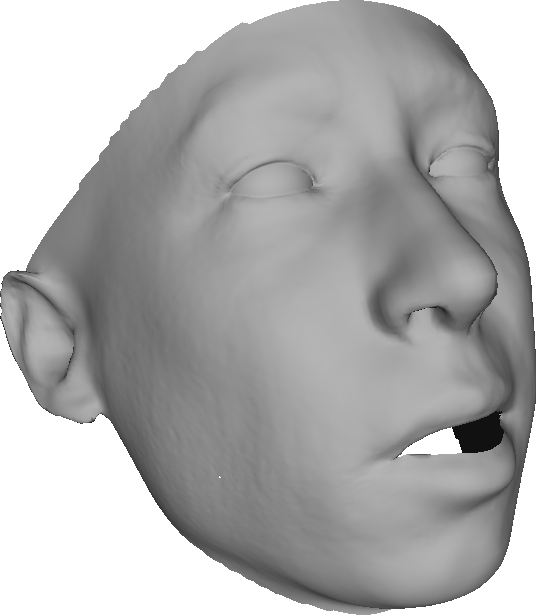

### input: ### 

### 3D Face Model: ### 
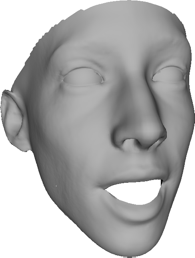

### input: ### 

### 3D Face Model: ### 
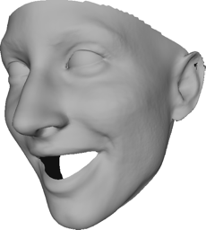

### input: ### 

### 3D Face Model: ### 
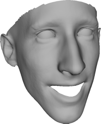

### input: ### 
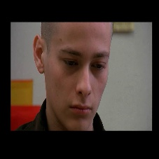
### 3D Face Model: ### 
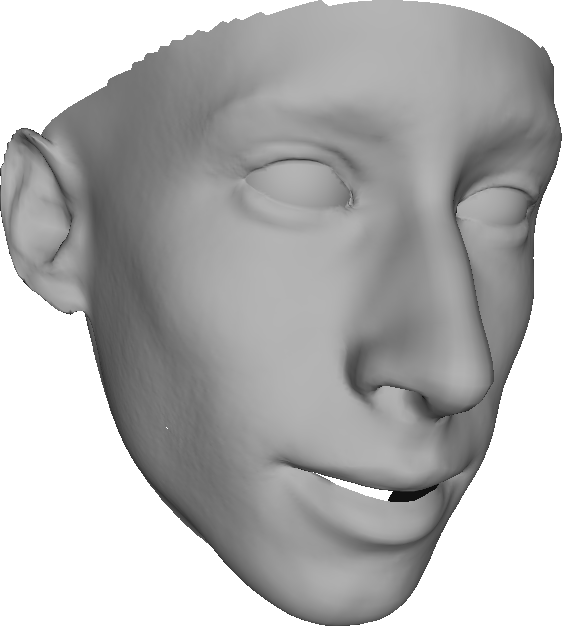

### input: ### 

### 3D Face Model: ### 
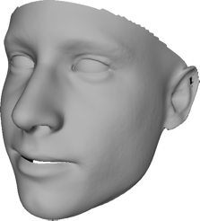

### input: ### 

### 3D Face Model: ### 
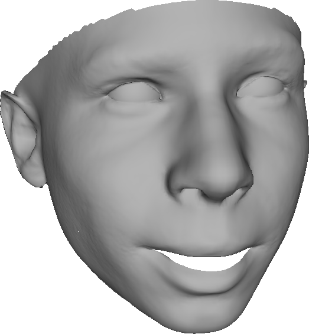

### input: ### 
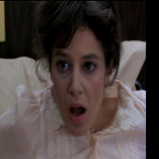
### 3D Face Model: ### 
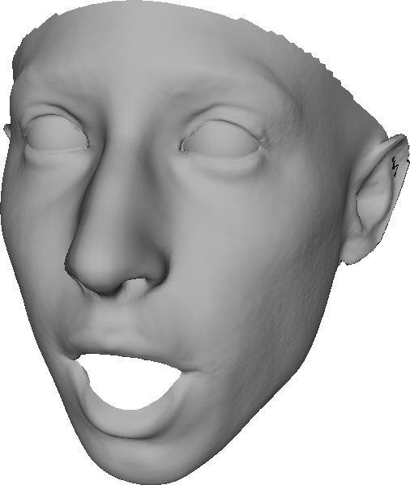

### input: ### 

### 3D Face Model: ### 
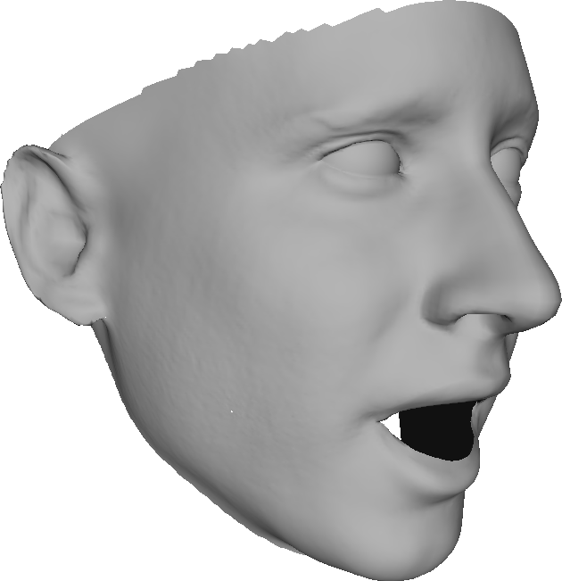

